# Sentinel Protection Implementation

> **How Sentinel protects DeFi swaps from attacks using instant off-chain coordination**

---

## The Problem: Timing Attacks

When you submit a swap on Uniswap, your transaction sits in the **mempool** (public waiting area) before being included in a block. Attackers can:

1. **See your pending swap** in the mempool
2. **Front-run you** by submitting a swap before yours with higher gas
3. **Back-run you** by submitting another swap after yours
4. **Profit** from the price movement you caused

This is called a **sandwich attack**. The attacker makes money, you get a worse price.

### Why Traditional Protection Fails

Most protection solutions use **on-chain transactions** to activate protection. But here's the problem:

```
You: Submit protection → Goes to mempool → Attacker sees it → Attacks anyway!
```

**Any on-chain transaction can be front-run before it's confirmed.**

---

## The Solution: Yellow Network Pre-Authorization

Sentinel solves this with a simple insight: **protection must happen BEFORE any transaction enters the mempool**.

### How It Works

```mermaid
graph LR
    A[🔍 Detect Attack] --> B[✍️ Sign Protection]
    B --> C[📡 Broadcast via Yellow]
    C --> D[🛡️ Protection Active]
    D --> E[📝 Settle On-Chain Later]
    
    style C fill:#f9d71c
    style D fill:#90EE90
```



1. **Detect Attack** (off-chain): Our agents spot suspicious patterns
2. **Sign Protection** (off-chain): Executor signs an authorization message
3. **Broadcast via Yellow** (off-chain): Sent instantly via WebSocket (<50ms)
4. **Protection Active**: Hook checks signature before allowing swaps
5. **Settle Later** (on-chain): Batch commit for audit trail

**Key insight**: Steps 1-4 happen **entirely off-chain**. No mempool exposure!

---

## System Components

### The Agents (Off-Chain)


| Agent | What It Does | Example Detection |
|-------|--------------|-------------------|
| **Scout** | Monitors mempool activity | "Large swap coming, gas spike detected!" |
| **Validator** | Compares oracle vs DEX prices | "Chainlink shows $2500, DEX shows $2300!" |
| **Risk Engine** | Calculates threat score | "Score 85/100 = CRITICAL threat" |
| **Executor** | Activates protection | "Signed authorization, broadcasting now!" |

### The Contracts (On-Chain)

| Contract | Purpose |
|----------|---------|
| **SentinelHook** | Uniswap v4 hook that checks authorization before every swap |
| **YellowOracle** | Stores and verifies protection signatures |
| **AgentRegistry** | Whitelist of authorized Sentinel agents |

---

## Off-Chain vs On-Chain: How They Work Together

This is the core architecture that makes Sentinel work:

### The Two Worlds


### What Happens Where

| Layer | Speed | Visibility | Gas Cost | Purpose |
|-------|-------|------------|----------|---------|
| **Off-Chain** | <50ms | Private | Zero | Detection, decision, authorization |
| **On-Chain** | ~12s | Public | Yes | Verification, execution, settlement |

### The Flow Between Layers

```
┌─────────────────────────────────────────────────────────────────┐
│                      OFF-CHAIN LAYER                            │
│                   (Yellow Network + Agents)                     │
├─────────────────────────────────────────────────────────────────┤
│                                                                 │
│   Scout detects attack pattern                                  │
│           ↓                                                     │
│   Risk Engine scores threat (85/100 = CRITICAL)                │
│           ↓                                                     │
│   Executor signs authorization message                          │
│           ↓                                                     │
│   Yellow broadcasts to all listeners (<50ms)                   │
│           ↓                                                     │
│   Signature stored in "signature pool" (off-chain cache)        │
│                                                                 │
├─────────────────────────────────────────────────────────────────┤
│                       ↓ BRIDGE ↓                                │
│            (Signature included in swap hookData)                │
├─────────────────────────────────────────────────────────────────┤
│                      ON-CHAIN LAYER                             │
│                  (Ethereum/Base/Arbitrum)                       │
├─────────────────────────────────────────────────────────────────┤
│                                                                 │
│   User/Router submits swap with hookData containing signature   │
│           ↓                                                     │
│   SentinelHook.beforeSwap() receives the swap                  │
│           ↓                                                     │
│   Hook extracts signature from hookData                         │
│           ↓                                                     │
│   YellowOracle.verifySignature() checks validity               │
│           ↓                                                     │
│   If valid: Apply dynamic fee (26 bps during attack)           │
│   If invalid: Fall back to normal fee (5 bps)                  │
│                                                                 │
└─────────────────────────────────────────────────────────────────┘
```

---

## HookData: The Bridge Between Off-Chain and On-Chain

### What is hookData?

In Uniswap v4, every swap can include optional **hookData** - arbitrary bytes that get passed to the hook contract. Sentinel uses this to bridge the off-chain and on-chain worlds.

### Where Does hookData Come From?


### HookData Content

When protection is active, hookData contains:

| Field | Type | Purpose |
|-------|------|---------|
| action | uint8 | 1=Attack, 2=Oracle, 3=CircuitBreaker |
| fee | uint24 | Dynamic fee in basis points (e.g., 26) |
| expiryBlock | uint256 | When this authorization expires |
| timestamp | uint256 | When it was created |
| nonce | uint256 | Prevents replay attacks |
| signature | bytes | ECDSA signature from Executor |

### Three Ways Protection Works

**Method 1: hookData Signature (Fastest)**
```
Router includes Yellow signature in hookData
   ↓
Hook verifies signature on-the-fly
   ↓
No YellowOracle query needed!
```

**Method 2: Settled Authorization (Fallback)**
```
No hookData provided
   ↓
Hook queries YellowOracle.getAuthorization(poolId)
   ↓
Returns stored authorization (from batch settlement)
```

**Method 3: No Protection (Normal)**
```
No hookData, no stored authorization
   ↓
Normal swap with base fee (5 bps)
```

### Who Provides the hookData?

| Actor | How They Get hookData |
|-------|----------------------|
| **Sentinel-aware routers** | Query Yellow API before each swap |
| **SDK integrations** | Automatically include if protection active |
| **Direct users** | Can manually include signature |
| **Unaware users** | Fall back to Method 2 or 3 |

> **Important**: Even if a user doesn't include hookData, they're still protected! The hook will check YellowOracle for any settled authorization (Method 2).

---

## Protection Tiers

### ELEVATED (Score 40-70): Warning Mode

When we detect **possible** issues but aren't certain:


**What happens:**
- ⚠️ On-chain event broadcast
- 📢 LP bots receive warning
- 🔓 Swaps continue normally
- ⏱️ ~500ms latency

**Example**: Oracle price difference of 5% detected. We warn LPs but don't block swaps.

---

### CRITICAL (Score >70): Protection Mode

When we detect **confirmed** attacks:

```mermaid
sequenceDiagram
    participant Agents
    participant Yellow Network
    participant SentinelHook
    participant Swapper
    
    Agents->>Yellow Network: Sign + broadcast auth (off-chain)
    Note over Yellow Network: ⚡ <50ms, NO mempool!
    Yellow Network-->>Agents: Confirmation
    
    Note over Swapper: Later...
    Swapper->>SentinelHook: swap(hookData=signature)
    SentinelHook->>SentinelHook: Check Yellow authorization
    SentinelHook-->>Swapper: Apply 26bps fee (instead of 5bps)
```



**What happens:**
- 🔐 Off-chain signature broadcast
- ⚡ Protection active in <50ms
- 💰 Higher fees during attack (goes to LPs)
- 🚫 Attackers CANNOT front-run our protection

---

## How Swaps Are Protected

### Normal Swap (No Threat)

```
User submits swap → Hook checks → No active protection → 5 bps fee → Swap executes
```

### Protected Swap (During Attack)

```mermaid
sequenceDiagram
    participant User
    participant SentinelHook
    participant YellowOracle
    
    User->>SentinelHook: swap(amount, hookData)
    
    SentinelHook->>SentinelHook: beforeSwap()
    
    alt hookData contains Yellow signature
        SentinelHook->>SentinelHook: Decode signature from hookData
        SentinelHook->>YellowOracle: verifyInstantAuthorization(...)
        YellowOracle-->>SentinelHook: ✅ Valid, signer is authorized
        Note over SentinelHook: Apply 26bps fee
    else No hookData - check settled auth
        SentinelHook->>YellowOracle: getAuthorization(poolId)
        YellowOracle-->>SentinelHook: ✅ Active authorization exists
        Note over SentinelHook: Apply stored fee
    else No protection active
        Note over SentinelHook: Apply base 5bps fee
    end
    
    SentinelHook-->>User: Swap executes
```



### What the Hook Checks

1. **Is there a signature in hookData?** (instant verification)
2. **Is there a settled authorization?** (from batch settlement)
3. **Is the signer authorized?** (registered in AgentRegistry)
4. **Is it still valid?** (not expired)
5. **What fee should be applied?** (5-30 bps based on threat)

### Three Protection Actions

| Action | Trigger | Effect |
|--------|---------|--------|
| **Attack Protection** | Sandwich attack detected | Higher swap fees (5→30 bps) |
| **Oracle Validation** | Price deviation >5% | Require price consistency |
| **Circuit Breaker** | Critical exploit | Pause pool entirely |

---

## Why This Works Against Attackers

### The Attacker's Dilemma

**Without Sentinel:**
```
Attacker sees victim tx → Front-runs → Victim swap → Back-runs → Profit!
```

**With Sentinel:**
```
Attacker sees victim tx
   ↓
Sentinel ALREADY activated protection (via Yellow, <50ms earlier)
   ↓
Attacker's front-run pays 26bps fee
   ↓
Victim's swap pays 26bps fee
   ↓
Attacker's back-run pays 26bps fee
   ↓
Profit margin SQUEEZED → Attack less profitable
   ↓
Extra fees go to LPs! 🎉
```

### Key Protection Properties

| Property | How Sentinel Achieves It |
|----------|-------------------------|
| **No mempool exposure** | Yellow broadcasts off-chain |
| **Instant activation** | <50ms via WebSocket |
| **Cannot be front-run** | Protection exists before attacker sees it |
| **Verifiable** | Cryptographic signatures from authorized agents |
| **Decentralized** | On-chain settlement provides public audit trail |

---

## Yellow Network's Role

Yellow Network provides the **instant communication layer** between agents:


### Why Yellow Network?

1. **Speed**: WebSocket messages in milliseconds
2. **Privacy**: Agent coordination not visible in mempool
3. **Efficiency**: No gas for agent-to-agent communication
4. **Settlement**: On-chain batch commits for finality

---

## Complete Attack Timeline

### Sandwich Attack with Sentinel Protection

| Time | Event | Layer |
|------|-------|-------|
| T+0.0s | Attacker submits front-run tx | On-chain (mempool) |
| T+0.1s | Scout detects suspicious pattern | **Off-chain** |
| T+0.2s | Risk Engine: Score 85 (CRITICAL) | **Off-chain** |
| T+0.25s | Executor signs authorization | **Off-chain** |
| T+0.30s | Yellow broadcasts signature | **Off-chain** |
| T+0.35s | **Protection now active** | **Off-chain** |
| T+12.0s | Front-run included in block (26bps fee) | On-chain |
| T+12.0s | Victim swap included (26bps fee) | On-chain |
| T+12.0s | Back-run included (26bps fee) | On-chain |
| T+42.0s | Batch settlement commits to chain | On-chain |

**Result**: Attack still happens, but profitability reduced. LPs earn extra fees.

---

## Settlement: Finality Without Delay

### The Two-Phase Approach

**Phase 1: Instant Protection (Off-Chain)**
- Sign authorization
- Broadcast via Yellow
- Protection active in <50ms
- Zero gas cost

**Phase 2: Settlement (On-Chain)**
- Batch authorizations every 30 seconds
- Single transaction for multiple protections
- Creates public audit trail
- Enables decentralized verification

### Why Batch Settlement?

| Single Authorization | Batched (10 auths) |
|---------------------|-------------------|
| ~100k gas each | ~400k gas total |
| 100k × 10 = 1M gas | 400k gas |
| **60% gas savings!** | ✅ |

---

## Summary: How Swaps Are Saved

```
┌─────────────────────────────────────────────────────────────────┐
│                      SENTINEL PROTECTION                        │
├─────────────────────────────────────────────────────────────────┤
│                                                                 │
│   OFF-CHAIN (Yellow Network)                                    │
│   ─────────────────────────                                     │
│   1. DETECT        Agents monitor mempools and oracles          │
│   2. DECIDE        Risk Engine calculates threat score          │
│   3. SIGN          Executor creates authorization signature     │
│   4. BROADCAST     Yellow delivers in <50ms (NO MEMPOOL!)       │
│                                                                 │
│   ON-CHAIN (Ethereum/Base/Arbitrum)                            │
│   ────────────────────────────────                              │
│   5. INCLUDE       hookData contains signature OR query Oracle  │
│   6. VERIFY        SentinelHook checks signature validity       │
│   7. PROTECT       Apply dynamic fee (5-30 bps)                 │
│   8. SETTLE        Batch commit for public audit trail          │
│                                                                 │
├─────────────────────────────────────────────────────────────────┤
│                                                                 │
│   ✅ Attackers CANNOT front-run our protection                  │
│   ✅ hookData bridges off-chain authorization to on-chain hook │
│   ✅ Protection works even without hookData (fallback to Oracle)│
│   ✅ Users get fair prices even during attack attempts          │
│                                                                 │
└─────────────────────────────────────────────────────────────────┘
```

### The Key Innovation

**Traditional protection**: On-chain tx → Mempool → Attacker sees → Front-runs → Fails

**Sentinel protection**: Off-chain signature → Yellow broadcast → hookData inclusion → Hook verifies → Protected!

By moving the critical protection step **off-chain**, we eliminate the timing window that attackers exploit. The hookData mechanism bridges this off-chain authorization into the on-chain swap execution seamlessly.

---

## Key Metrics

| Metric | Value |
|--------|-------|
| Protection Activation | <50ms |
| Threat Detection | <1 second |
| Gas Cost (Initial) | 0 ETH |
| Gas Cost (Settlement) | ~40k gas/auth |
| Fee Range | 5-30 bps |
| Settlement Frequency | Every 30 seconds |

---

**Sentinel: Protection that's faster than the attackers.** 🛡️
