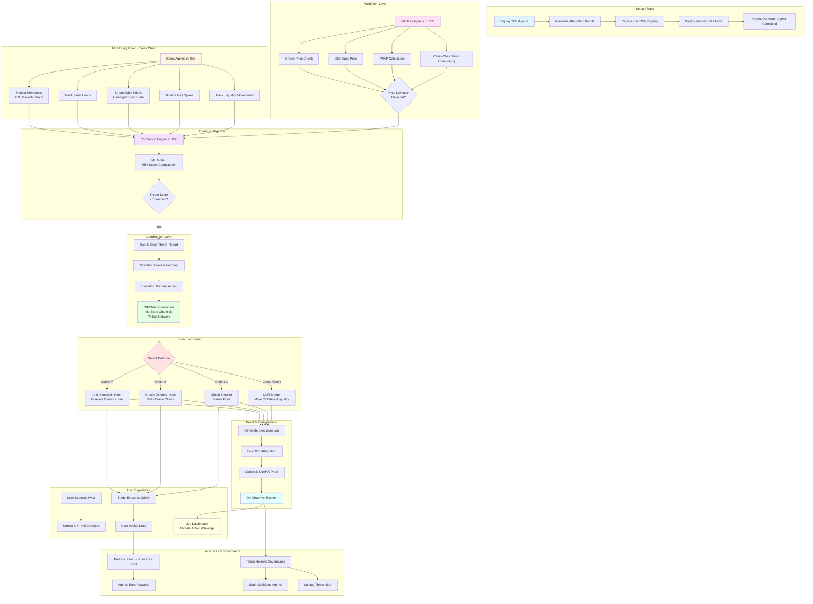

```mermaid
graph TB
    subgraph "Setup Phase"
        A[Deploy TEE Agents] --> B[Generate Attestation Proofs]
        B --> C[Register on ENS Registry]
        C --> D[Deploy Uniswap v4 Hooks]
        D --> E[Hooks Dormant - Agent Controlled]
    end

    subgraph "Monitoring Layer - Cross Chain"
        F[Scout Agents in TEE]
        F --> G[Monitor Mempools<br/>ETH/Base/Arbitrum]
        F --> H[Track Flash Loans]
        F --> I[Stream DEX Prices<br/>Uniswap/Curve/Sushi]
        F --> J[Monitor Gas Spikes]
        F --> K[Track Liquidity Movements]
    end

    subgraph "Validation Layer"
        L[Validator Agents in TEE]
        L --> M[Oracle Price Check]
        L --> N[DEX Spot Price]
        L --> O[TWAP Calculation]
        L --> P[Cross-Chain Price Consistency]
        M & N & O & P --> Q{Price Deviation<br/>Detected?}
    end

    subgraph "Threat Intelligence"
        R[Correlation Engine in TEE]
        G & H & I & J & K --> R
        Q --> R
        R --> S[ML Model:<br/>MEV Score Computation]
        S --> T{Threat Score<br/>> Threshold?}
    end

    subgraph "Coordination Layer"
        T -->|Yes| U[Scout: Send Threat Report]
        U --> V[Validator: Confirm Anomaly]
        V --> W[Executor: Prepare Action]
        W --> X[Off-Chain Consensus<br/>via State Channels<br/>Yellow Network]
    end

    subgraph "Execution Layer"
        X --> Y{Select Defense}
        Y -->|Option A| Z1[Anti-Sandwich Hook<br/>Increase Dynamic Fee]
        Y -->|Option B| Z2[Oracle Defense Hook<br/>Multi-Oracle Check]
        Y -->|Option C| Z3[Circuit Breaker<br/>Pause Pool]
        Y -->|Cross-Chain| Z4[LI.FI Bridge<br/>Move Collateral/Liquidity]
    end

    subgraph "Proof & Transparency"
        Z1 & Z2 & Z3 & Z4 --> AA[Generate Execution Log]
        AA --> AB[Emit TEE Attestation]
        AB --> AC[Optional: SNARK Proof]
        AC --> AD[On-Chain Verification]
    end

    subgraph "User Experience"
        AE[User Submits Swap] --> AF[Normal UX - No Changes]
        Z1 & Z2 & Z3 --> AG[Trade Executes Safely]
        AG --> AH[User Avoids Loss]
        AD --> AI[Live Dashboard:<br/>Threats/Actions/Savings]
    end

    subgraph "Incentives & Governance"
        AH --> AJ[Protocol Fees → Insurance Pool]
        AJ --> AK[Agents Earn Rewards]
        AD --> AL[Token Holders Governance]
        AL --> AM[Slash Malicious Agents]
        AL --> AN[Update Thresholds]
    end

    style A fill:#e1f5ff
    style F fill:#fff4e1
    style L fill:#ffe1f5
    style R fill:#f5e1ff
    style X fill:#e1ffe1
    style Y fill:#ffe1e1
    style AD fill:#e1ffff
    style AI fill:#ffffe1
```