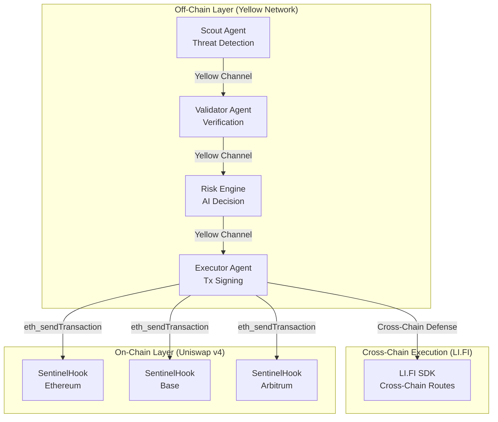
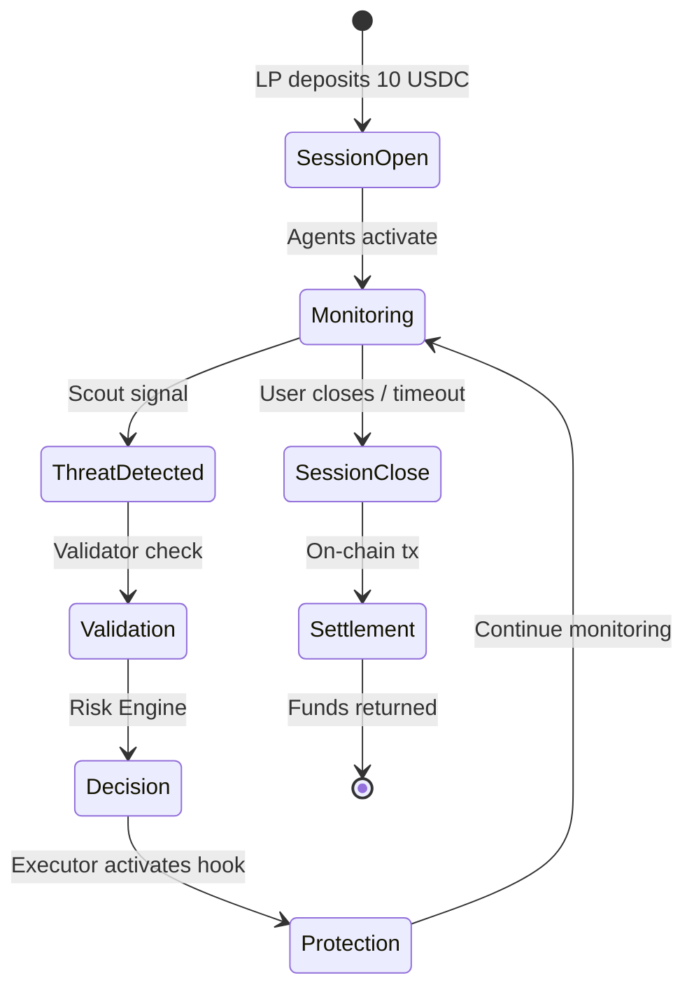

<div align="center">

# 🛡️ Sentinel

**Verifiable AI Agent Network for Cross-Chain MEV Protection & Oracle Security**

[Uniswap Track](TRACK_UNISWAP_V4.md) • [LI.FI Track](TRACK_LIFI.md) • [Yellow Track](TRACK_YELLOW_NETWORK.md)

</div>

---

## 🎯 Overview

Sentinel is a **DEFI security infrastructure** that uses **verifiable AI agents** running inside **TEE** to protect DeFi liquidity from oracle manipulation, sandwich attacks, flash loan exploits, front-running, just-in-time (JIT) liquidity abuse, price impact manipulation, and cross-chain arbitrage across multiple blockchains.

The system continuously monitors cross-chain mempools, liquidity pools, and oracle prices, correlates weak signals into high-confidence threats, and **autonomously executes defensive actions** using **Uniswap v4 hooks** and **cross-chain bridges**.

### Key Innovation

**Security-as-a-Session**: Users deposit funds once into a Yellow Network session, agents monitor continuously with micro-fees deducted off-chain (0.001 USDC per action), and settle once when done. **1,000+ protection actions for <$1 in fees, 1 gas payment.**

---

## ✨ Features

### 🔍 **Multi-Chain Threat Detection**
- Real-time mempool monitoring across Ethereum, Base, and Arbitrum
- Flash loan detection and correlation
- Oracle manipulation tracking
- Sandwich attack pattern recognition
- Cross-chain arbitrage opportunity detection

### 🤖 **Autonomous Agent Network**
- **Scout Agents**: Detect threats and emit signals via Yellow Network
- **Validator Agents**: Verify threats using multi-oracle consensus
- **Risk Engine**: AI-powered threat classification and decision making
- **Executor Agents**: Activate on-chain defenses via Uniswap v4 hooks

### 🛡️ **Protocol-Native Defenses**
- **Dynamic Fee Adjustment**: Increase swap fees to deter attackers
- **Circuit Breakers**: Temporary pool pausing during high-risk periods
- **Oracle Validation**: Multi-source price verification before swaps
- **Cross-Chain Rebalancing**: Emergency liquidity movement via LI.FI

### 🔐 **Verifiable Execution**
- All agents run inside **TEEs** (Trusted Execution Environments)
- **Remote attestations** prove code integrity
- **Cryptographic proofs** of every decision
- Full **audit trail** on Yellow Network state channels

### ⚡ **Pay-Per-Use Economics**
- Open protection session with 10 USDC
- Micro-fees: 0.001-0.01 USDC per action (off-chain)
- Single on-chain settlement transaction
- 60-95% cost reduction vs traditional security

---

## 🏗️ Architecture



---
## 🎯 Problem Statement

Modern DeFi attacks are no longer isolated or simple:

- **MEV attacks** rely on cross-chain liquidity fragmentation and mempool visibility
- **Oracle manipulation** via flash loans remains a dominant exploit vector
- **AI agents** are increasingly entrusted with capital, but execution correctness is unverifiable
- **Existing defenses** are reactive, static, opaque, or centralized

Sentinel addresses this gap by combining:
- ✅ Cross-chain monitoring
- ✅ Adaptive risk modeling
- ✅ Autonomous agent execution
- ✅ Verifiable compute guarantees
- ✅ Protocol-native enforcement (Uniswap v4 hooks)

---

## 🤖 Agent Architecture

Sentinel uses a **strict separation of concerns** across four specialized agents:

### 1. Scout Agent (Signal Generator)

**Role**: Fast, weak signal detection

**Monitors**:
- Mempools across Ethereum, Base, Arbitrum
- Flash loan activity (Aave, Balancer, dYdX)
- Gas spikes and unusual transaction clustering
- Large swaps and abnormal price movements
- Liquidity migration patterns

**Output**: Raw threat signals (no decisions)

**Implementation**: [agent/src/scout/](agent/src/scout/)

---

### 2. Validator Agent (Truth Verifier)

**Role**: High-confidence threat verification

**Validates**:
- Oracle prices (Chainlink, Pyth, Chainlink Data Streams)
- DEX spot prices vs TWAP
- Cross-chain price consistency
- Historical attack patterns

**Output**: Verified threat alerts

**Implementation**: [agent/src/validator/](agent/src/validator/)

---

### 3. Risk Engine (Decision Brain)

**Role**: Correlation and decision making

**Core Logic**:
- Correlates Scout + Validator signals
- Maintains **adaptive thresholds** using Exponential Moving Average (EMA)
- Computes **composite risk scores** over sliding correlation windows
- Manages **threat state machine**:
  ```
  WATCH → ELEVATED → CRITICAL (with hysteresis)
  ```
- Maps threats to defense actions:
  - `MEV_PROTECTION` → Dynamic fee increase
  - `ORACLE_VALIDATION` → Multi-oracle check
  - `CIRCUIT_BREAKER` → Pool pause

**Critical Properties**:
- ⚠️ **Only** the Risk Engine can make action decisions
- Outputs time-bounded `RiskDecision` structs with TTL
- Enforces RPC budget constraints via token bucket
- Anti-flapping via hysteresis

**Output**: Deterministic execution decisions

**Implementation**: [agent/src/executor/src/RiskEngine.ts](agent/src/executor/src/RiskEngine.ts)

---

### 4. Executor Agent (Deterministic Actor)

**Role**: Execute Risk Engine decisions only

**Actions**:
- Activate Uniswap v4 hook protections
- Cross-chain execution via LI.FI SDK
- Respect decision TTL (automatic expiry)
- Sign transactions inside TEE

**Critical Constraint**:
- ⚠️ **Never** implements risk logic
- ⚠️ Only executes pre-authorized decisions from Risk Engine

**Output**: On-chain transactions, TEE attestations

**Implementation**: [agent/src/executor/src/Execution.ts](agent/src/executor/src/Execution.ts)

---

## 🧠 Risk Engine Intelligence

The Risk Engine is the **core decision layer** that replaces static thresholds with adaptive, correlation-based intelligence.

### Per-Pool EMA Tracking

Each pool maintains **separate EMA trackers for each signal type** (FLASH_LOAN, GAS_SPIKE, ORACLE_MANIPULATION, etc.):

```typescript
// Update EMA on each signal
ema_t = α × magnitude + (1 - α) × ema_{t-1}  // α = 0.1

// Adaptive threshold expands in volatile markets
threshold = base × (1 + 2 × normalized_ema)  // 1× to 3× expansion
```

**Result**: Quiet markets get tight bounds; volatile markets adapt automatically.

### Signal Scoring Pipeline

```typescript
// 1. Score against adaptive threshold
excess = (magnitude - threshold) / threshold
normalized_score = min(1, excess)  // 0 to 1

// 2. Apply signal weight (ORACLE_MANIPULATION=3.5, FLASH_LOAN=2.5, etc.)
weighted_score = normalized_score × (weight / total_weights) × 100

// 3. Add to correlation window (24s sliding window)
pool.signals.push(scored_signal)

// 4. Composite score = SUM of all weighted scores (not average!)
composite = clamp(sum(weighted_scores), 0, 100)
```

**Key Insight**: Individual signals score low (~20). Correlated signals (FLASH_LOAN + GAS_SPIKE + LARGE_SWAP) score 75+ → triggers defense.

### Threat State Machine with Hysteresis

```
WATCH
  ↓ score > 35
ELEVATED
  ↓ score > 70
CRITICAL → Execute Defense
  ↓ score < 50 (hysteresis gap prevents flapping)
ELEVATED
  ↓ score < 20
WATCH
```

**Hysteresis bands**: `{watchToElevated: {up:35, down:20}, elevatedToCritical: {up:70, down:50}}`

### Decision Output

```typescript
interface RiskDecision {
  action: 'MEV_PROTECTION' | 'ORACLE_VALIDATION' | 'CIRCUIT_BREAKER';
  poolId: bytes32;
  severity: 'HIGH' | 'CRITICAL';
  ttl: number;  // seconds
  fee?: number;  // bps (for MEV_PROTECTION)
  duration?: number;  // blocks (for CIRCUIT_BREAKER)
  decisionHash: bytes32;  // commitment
}
```

---

## 🔗 Uniswap v4 Hook Architecture

Sentinel uses a **single composite hook contract per pool** supporting multiple defense mechanisms.

### Hook Execution Order (`beforeSwap`)

```solidity
1. Circuit Breaker Check (highest priority)
   → May revert("Pool paused")
   
2. Oracle Validation
   → May revert("Price manipulation detected")
   
3. Anti-Sandwich Protection
   → Adjusts dynamic fee (does not revert)
```

### Hook States

```solidity
struct ProtectionConfig {
    bool circuitBreakerActive;
    uint256 circuitBreakerExpiresAt;
    
    bool oracleValidationEnabled;
    address chainlinkFeed;
    uint256 maxDeviationBps;
    
    bool antiSandwichActive;
    uint24 emergencyFee;
    uint256 feeActivatedAt;
}
```

### Agent Authorization

```solidity
modifier onlyAgent() {
    require(agentRegistry.isAuthorized(msg.sender), "Unauthorized");
    _;
}
```

**Implementation**: [contracts/src/SentinelHook.sol](contracts/src/SentinelHook.sol)

---

## 🟡 Yellow Protection Session

Sentinel uses Yellow Network (Nitrolite) to enable **Security-as-a-Session**.

### Session Lifecycle



### Micro-Fee Accounting

```typescript
// Off-chain balance tracking
sessionBalance -= feeAmount;  // Instant, 0 gas

// Audit trail
auditTrail.push({
  type: 'SCOUT_SIGNAL',
  timestamp: Date.now(),
  cost: 0.001,  // USDC
  data: signal
});
```

### Settlement

```typescript
// Single on-chain transaction
await nitroliteClient.settleSession({
  totalActions: auditTrail.length,
  totalCost: calculateTotalCost(),
  remainingBalance: sessionBalance,
  agentRewards: calculateRewards(),
  merkleRoot: computeMerkleRoot(auditTrail)
});
```

**Implementation**: [agent/src/shared/yellow/YellowMessageBus.ts](agent/src/shared/yellow/YellowMessageBus.ts)

---

## 🔄 End-to-End Flow

### Complete Protection Cycle

```
1. Setup Phase
   → Agents boot inside TEEs, generate attestations
   → Register with AgentRegistry
   → Yellow session initialized

2. Monitoring Phase (Off-Chain)
   → Scout: Detects mempool anomaly
   → Scout: Publishes signal via Yellow (-0.001 USDC)
   
3. Validation Phase (Off-Chain)
   → Validator: Checks oracle prices
   → Validator: Confirms threat via Yellow (-0.001 USDC)
   
4. Decision Phase (Off-Chain)
   → Risk Engine: Correlates signals
   → Risk Engine: Threat → CRITICAL state
   → Risk Engine: Emits RiskDecision via Yellow (-0.001 USDC)
   
5. Execution Phase (On-Chain)
   → Executor: Receives decision
   → Executor: Signs tx in TEE
   → Executor: Calls hook.activateProtection() (-0.01 USDC)
   → Hook: Intercepts next swap, applies defense
   
6. Protection Phase
   → User swaps execute with protection active
   → Attack deterred / blocked
   
7. Settlement Phase (On-Chain)
   → Session closes after 24h or manual trigger
   → Final balance settled (1 gas payment)
   → Unused funds returned to LP
   → Agent rewards distributed
```

**Total Cost**: 0.012 USDC + gas for settlement  
**Alternate Cost (Traditional)**: $50-100 in gas fees for equivalent monitoring

---

## 🔐 Security & Verifiability

### Trusted Execution Environments (TEEs)

All agents run inside TEEs (Phala / Oasis / EigenCompute).

**Properties**:
- ✅ Deterministic code hash
- ✅ Private keys sealed inside enclave
- ✅ Remote attestation proves execution integrity
- ✅ No external key exposure

**TEE Outputs**:
```typescript
{
  signedTransaction: '0x...',
  attestation: {
    codeHash: '0xABCD...',
    timestamp: 1234567890,
    signature: '0xSIG...'
  },
  executionLog: { ... }
}
```

### Verification Flow

```solidity
function activateProtection(
    bytes32 poolId,
    uint24 emergencyFee,
    bytes32 decisionHash,
    bytes memory attestation  // TEE proof
) external onlyAgent {
    // 1. Verify agent ran correct TEE code
    require(_verifyTEEAttestation(msg.sender, attestation));
    
    // 2. Verify decision integrity
    require(_verifyDecisionHash(decisionHash, attestation));
    
    // 3. Execute protection
    protectionState[poolId] = ProtectionConfig({
        active: true,
        emergencyFee: emergencyFee,
        attestationHash: keccak256(attestation)
    });
}
```

### Transparency

- 🔍 All decisions logged on-chain with `decisionHash`
- 🔍 Full audit trail available via Yellow Network
- 🔍 Agent code is open source and auditable
- 🔍 TEE attestations publicly verifiable

---
## � Quick Start

### Prerequisites

- Node.js 18+
- Foundry ([installation guide](https://book.getfoundry.sh/getting-started/installation))
- Docker (for agent deployment)
- Testnet ETH on Ethereum Sepolia, Base Sepolia, Arbitrum Sepolia

### 1. Clone Repository

```bash
git clone https://github.com/viscous-236/Sentinel.git
cd Sentinel
```

### 2. Install Dependencies

```bash
# Install root dependencies
npm install

# Install agent dependencies
cd agent
npm install

# Install contract dependencies
cd ../contracts
forge install
```

### 3. Configure Environment

```bash
# Agent configuration
cd agent
cp .env.example .env
# Edit .env with your RPC URLs, private keys, and API keys

# Contract configuration
cd ../contracts
cp .env.example .env
# Edit .env with deployment credentials
```

### 4. Deploy Contracts

```bash
cd contracts

# Deploy to all testnets
./deploy-multichain.sh

# Or deploy to single chain
forge script Script/DeploySentinelHook.s.sol \
  --rpc-url $ETHEREUM_SEPOLIA_RPC \
  --broadcast \
  --verify
```

### 5. Run Agent Network

```bash
cd agent

# Run local development mode
npm run dev

# Run E2E integration tests
npm run test:e2e:all

# Run Yellow Network simulation
npm run test:yellow:simulation
```

---

## � Project Structure

```
Sentinel/
├── agent/                      # AI agent network (TypeScript)
│   ├── src/
│   │   ├── scout/             # Threat detection agents
│   │   ├── validator/         # Verification agents
│   │   ├── executor/          # Execution agents
│   │   │   ├── src/
│   │   │   │   ├── RiskEngine.ts          # AI decision logic
│   │   │   │   ├── Execution.ts           # Hook activation
│   │   │   │   └── CrossChainOrchestrator.ts  # LI.FI integration
│   │   └── shared/
│   │       └── yellow/        # Yellow Network integration
│   ├── tests/
│   │   └── e2e/               # End-to-end test suites
│   └── Dockerfile             # Agent containerization
│
├── contracts/                  # Smart contracts (Solidity)
│   ├── src/
│   │   ├── SentinelHook.sol   # Uniswap v4 hook implementation
│   │   ├── AgentRegistry.sol  # Agent authorization
│   │   └── Interfaces/        # Contract interfaces
│   ├── Script/                # Deployment scripts
│   ├── test/                  # Contract tests
│   └── deployments/           # Deployment artifacts
│
├── frontend/                   # Web dashboard (Next.js)
│   ├── app/                   # Next.js app router
│   ├── components/            # React components
│   └── lib/                   # Utilities
├── TRACK_UNISWAP_V4.md        # Uniswap track submission
├── TRACK_LIFI.md              # LI.FI track submission
└── TRACK_YELLOW_NETWORK.md    # Yellow Network track submission
```

---

## 🌐 Deployed Contracts

### SentinelHook (Uniswap v4)

| Network | Hook Address | Pool Manager | Explorer |
|---------|-------------|--------------|----------|
| **Ethereum Sepolia** | [`0xb0dD14...9765b`](https://sepolia.etherscan.io/address/0xb0dD144187F0e03De762E05F7097E77A9aB9765b) | `0x8C4BcB...afa5F1A` | [View →](https://sepolia.etherscan.io/address/0xb0dD144187F0e03De762E05F7097E77A9aB9765b) |
| **Base Sepolia** | [`0x3cC61A...c99B`](https://sepolia.basescan.org/address/0x3cC61A0fC30b561881a39ece40E230DC02D4c99B) | `0x7Da1D6...AA829` | [View →](https://sepolia.basescan.org/address/0x3cC61A0fC30b561881a39ece40E230DC02D4c99B) |
| **Arbitrum Sepolia** | [`0xb0dD14...9765b`](https://sepolia.arbiscan.io/address/0xb0dD144187F0e03De762E05F7097E77A9aB9765b) | `0x8C4BcB...afa5F1A` | [View →](https://sepolia.arbiscan.io/address/0xb0dD144187F0e03De762E05F7097E77A9aB9765b) |

**Agent Executor**: `0xC25dA7A84643E29819e93F4Cb4442e49604662f1`

---

## 🛠️ Development

### Run Agent Network Locally

```bash
cd agent
npm run dev
```

### Deploy New Hook

```bash
cd contracts
forge script Script/DeploySentinelHook.s.sol \
  --rpc-url $YOUR_RPC \
  --private-key $PRIVATE_KEY \
  --broadcast \
  --verify
```

### Test Hook Integration

```bash
cd agent
npm run test:e2e:onchain
```

### Monitor Yellow Session

```bash
cd agent

# Check session balance
npm run yellow:status

# View audit trail
npm run yellow:history

# Settle session
npm run yellow:settle
```

---

## 📊 Impact & Metrics

### Cost Efficiency

| Metric | Traditional Security | Sentinel + Yellow |
|--------|---------------------|-------------------|
| **Daily Monitoring Cost** | $50-100 (gas per check) | <$1 (off-chain) |
| **Response Time** | 10+ minutes (manual) | <1 minute (automated) |
| **Gas Transactions** | 100+ per day | 1 per day (settlement) |
| **LP Cost Savings** | - | **60-95%** |

### Protection Scenarios

- ✅ Sandwich attacks
- ✅ Oracle manipulation
- ✅ Flash loan exploits
- ✅ Rug pulls
- ✅ Cross-chain arbitrage attacks
- ✅ Governance attacks

---

## 🤝 Contributing

Contributions are welcome! Please see [AGENTS.md](AGENTS.md) for development guidelines.

1. Fork the repository
2. Create your feature branch (`git checkout -b feature/AmazingFeature`)
3. Commit your changes (`git commit -m 'Add some AmazingFeature'`)
4. Push to the branch (`git push origin feature/AmazingFeature`)
5. Open a Pull Request

---

## 📄 License

This project is licensed under the MIT License - see the [LICENSE](LICENSE) file for details.

---

## 🔗 Links

- **GitHub**: [github.com/viscous-236/Sentinel](https://github.com/viscous-236/Sentinell)
- **Uniswap Track**: [TRACK_UNISWAP_V4.md](TRACK_UNISWAP_V4.md)
- **LI.FI Track**: [TRACK_LIFI.md](TRACK_LIFI.md)
- **Yellow Track**: [TRACK_YELLOW_NETWORK.md](TRACK_YELLOW_NETWORK.md)

---

## 🙏 Acknowledgments

- **Uniswap Foundation** - For Uniswap v4 hooks framework
- **LI.FI Protocol** - For cross-chain execution infrastructure
- **Yellow Network** - For state channel technology
- **EigenX / Phala Network** - For TEE infrastructure

---

<div align="center">

**Built with ❤️ for HackMoney 2025**

</div>