# 🦄 Uniswap v4 Tracks - Agentic Finance & Privacy DeFi

## What We Built

**Autonomous AI agents that programmatically control Uniswap v4 hooks for real-time pool protection.**

Instead of passive monitoring, Sentinel agents **actively manage hook behavior** to defend against oracle manipulation, sandwich attacks, flash loan exploits, front-running, just-in-time (JIT) liquidity abuse, price impact manipulation, and cross-chain arbitrage.


---

## 🏗️ System Architecture


**Key Innovation**: Agents coordinate off-chain (fast, free) → enforce on-chain (secure, verifiable).

---

## 🤖 Track 1: Agentic Finance

### Agent → Hook Execution Flow

```mermaid
sequenceDiagram
    participant Scout as Scout Agent
    participant Risk as Risk Engine
    participant Executor as Executor Agent
    participant Hook as SentinelHook
    participant Swap as User Swap

    Scout->>Risk: Sandwich detected<br/>(via Yellow)
    Risk->>Risk: Calculate fee: 200 bps
    Risk->>Executor: Activate protection<br/>(via Yellow)
    Executor->>Hook: activateProtection(poolId, 200bps)
    Hook-->>Executor: ✅ Protection active
    
    Swap->>Hook: Initiates swap
    Hook->>Hook: beforeSwap() intercepts
    Hook->>Swap: Apply 200bps fee
    Note over Swap: Attack deterred 🛡️
```



### Implemented Features

#### 1. Dynamic Fee Management
```solidity
// SentinelHook.sol
function activateProtection(
    bytes32 poolId,
    uint24 emergencyFee,
    bytes32 decisionHash
) external onlyAgent {
    protectionState[poolId] = ProtectionConfig({
        active: true,
        emergencyFee: emergencyFee,
        activatedAt: block.timestamp
    });
}

function beforeSwap(...) external override {
    if (protectionState[poolId].active) {
        _applyEmergencyFee(poolId, params);
    }
}
```

**Agent Decision** ([RiskEngine.ts#L284](agent/src/executor/src/RiskEngine.ts#L284)):
- Sandwich attack → 3x fee increase for 5 blocks
- Oracle deviation >5% → pause until sync
- Flash loan spike → circuit breaker

#### 2. Circuit Breaker
```solidity
function activateCircuitBreaker(bytes32 poolId, uint256 duration) external onlyAgent {
    circuitBreakers[poolId] = CircuitBreaker({
        active: true,
        expiresAt: block.timestamp + duration
    });
}
```

**Use Case**: Flash loan detected → 10-block pause → LPs protected.

#### 3. Oracle Validation
```solidity
function beforeSwap(...) external override {
    if (oracleConfig[poolId].enabled) {
        uint256 onChainPrice = _getChainlinkPrice(poolId);
        uint256 dexPrice = _getDexPrice(params);
        
        if (_deviationExceedsThreshold(onChainPrice, dexPrice, poolId)) {
            revert("Price manipulation detected");
        }
    }
}
```

---

## 🕶️ Track 2: Privacy DeFi

### The Privacy Problem


**Solution**: Agents run inside Trusted Execution Environments (TEEs) where:
- Decision logic is **hidden** from attackers
- Execution is **cryptographically verifiable**
- Strategy parameters are **unpredictable**

### TEE Verification Flow

```mermaid
sequenceDiagram
    participant TEE as Agent in TEE
    participant Hook as SentinelHook
    participant Registry as Code Registry
    
    TEE->>TEE: Detect threat<br/>(private logic)
    TEE->>TEE: Generate attestation<br/>(proves code integrity)
    TEE->>Hook: activateProtection(fee, attestation)
    Hook->>Registry: Verify code hash
    Registry-->>Hook: ✅ Code approved
    Hook->>Hook: Apply protection
    
    Note over TEE,Hook: Attacker sees tx but<br/>cannot reverse-engineer strategy
```



### Implementation

```solidity
function activateProtection(
    bytes32 poolId,
    uint24 emergencyFee,
    bytes32 decisionHash,
    bytes memory attestation  // TEE proof
) external onlyAgent {
    require(
        _verifyTEEAttestation(msg.sender, attestation),
        "Invalid attestation"
    );
    
    protectionState[poolId] = ProtectionConfig({
        active: true,
        emergencyFee: emergencyFee,
        attestationHash: keccak256(attestation)
    });
}
```

**Privacy Features**:
- Strategy logic sealed in TEE
- Remote attestation verifies integrity
- Decision commits prevent frontrunning
- Yellow channels hide coordination

---

## 📍 Deployed Contracts

| Network | Hook Address | Pool Manager |
|---------|-------------|--------------|
| **Ethereum Sepolia** | [`0xb0dD14...9765b`](https://sepolia.etherscan.io/address/0xb0dD144187F0e03De762E05F7097E77A9aB9765b) | `0x8C4BcB...afa5F1A` |
| **Base Sepolia** | [`0x3cC61A...c99B`](https://sepolia.basescan.org/address/0x3cC61A0fC30b561881a39ece40E230DC02D4c99B) | `0x7Da1D6...AA829` |
| **Arbitrum Sepolia** | [`0xb0dD14...9765b`](https://sepolia.arbiscan.io/address/0xb0dD144187F0e03De762E05F7097E77A9aB9765b) | `0x8C4BcB...afa5F1A` |

**Agent Executor**: `0xC25dA7A84643E29819e93F4Cb4442e49604662f1`

---

