# 🟡 Yellow Network Track - Security-as-a-Session

## What We Built

**DeFi security reimagined as a pay-per-use session powered by Yellow state channels.**

Open a session with 10 USDC → agents monitor continuously → micro-fees deducted off-chain (0.001 USDC per action) → settle once when done → unused funds returned.

**1,000+ protection actions for <$1 in fees, 1 gas payment.**

---

## 🎯 The Problem

Traditional DeFi security models are broken:

```mermaid
graph TB
    
    subgraph "Yellow Model ✅"
        P2[Pay-per-session] --> O1[Open session once]
        O1 --> C1[1000+ checks off-chain]
        C1 --> S2[Settle once]
        S2 --> R1[Cost: <$1 total]
    end
```



---

## 🏗️ System Architecture


---

## 💡 User Journey


**The Magic**: 1,000+ protection actions, **1 gas payment** (settlement only).

---

## 🛠️ Technical Implementation

### Session Management

**YellowMessageBus** ([YellowMessageBus.ts](agent/src/shared/yellow/YellowMessageBus.ts)):

```typescript
export class YellowMessageBus extends EventEmitter {
  private sessionBalance: number;
  private auditTrail: ProtectionAction[] = [];
  
  async publishSignal(signal: ScoutSignal): Promise<void> {
    // Real Yellow Network API call
    await this.nitroliteClient.sendMessage({
      type: 'SCOUT_SIGNAL',
      payload: signal,
      fee: 0.001  // USDC
    });
    
    // Update balance off-chain (instant)
    this.sessionBalance -= 0.001;
    
    // Record for settlement
    this.auditTrail.push({
      type: 'SIGNAL',
      timestamp: Date.now(),
      cost: 0.001,
      data: signal
    });
  }
  
  async settleSession(): Promise<void> {
    const finalState = {
      totalActionsPerformed: this.auditTrail.length,
      totalCost: this.calculateTotalCost(),
      remainingBalance: this.sessionBalance,
      agentRewards: this.calculateRewards(),
      auditRoot: this.computeMerkleRoot(this.auditTrail)
    };
    
    // Single on-chain settlement tx
    await this.nitroliteClient.settleSession(finalState);
  }
}
```

### Agent Coordination


### Real Network Integration

```typescript
import { NitroliteClient } from 'yellow-ts';

export class YellowNetworkC {
  private client: NitroliteClient;
  
  async connect(): Promise<void> {
    this.client = new NitroliteClient({
      apiKey: process.env.YELLOW_API_KEY,
      network: 'sandbox'
    });
    
    await this.client.connect();
  }
  
  async sendMessage(message: Message): Promise<void> {
    await this.client.channels.send({
      channelId: this.channelId,
      payload: message,
      fee: message.fee
    });
  }
}
```

---

## 🛡️ Protection Scenarios

| Threat Type | Detection | Yellow Usage | Protection Action |
|-------------|-----------|--------------|-------------------|
| **Sandwich Attack** | Mempool pattern | Agent coordination | Dynamic fee increase |
| **Oracle Manipulation** | Price deviation | Multi-agent validation | Pool pause + alert |
| **Flash Loan Exploit** | Volume spike | Cross-chain correlation | Circuit breaker |
| **Rug Pull** | Liquidity withdrawal | Instant alert broadcast | Emergency LP notification |
| **Cross-Chain Arbitrage** | Multi-chain tracking | State synchronization | Liquidity rebalancing |

---

## 📈 Impact Comparison

| Metric | Traditional Security | Sentinel + Yellow |
|--------|---------------------|-------------------|
| **Monitoring Cost** | $50-100/day (gas per check) | <$1/day (off-chain) |
| **Response Time** | 10+ minutes (manual) | <1 minute (automated) |
| **Gas Transactions** | 100+ per day | 1 per day (settlement) |
| **Transparency** | Opaque (centralized) | Full audit trail |
| **LP Savings** | - | **60-95%** cost reduction |

---

## 📍 Live Infrastructure

**Yellow Session**:
- Agent: `0xC25dA7A84643E29819e93F4Cb4442e49604662f1`
- Network: Yellow Sandbox (Nitrolite testnet)
- Balance: `142.957 ytest.usd`
- Active Channels: 3 (Scout→Risk, Validator→Risk, Risk→Executor)

---

## 📚 Key Files

| Component | Purpose | File |
|-----------|---------|------|
| **YellowMessageBus** | Session + fee accounting | [agent/src/shared/yellow/YellowMessageBus.ts](agent/src/shared/yellow/YellowMessageBus.ts) |
| **YellowAgentAdapters** | Agent-to-Yellow binding | [agent/src/shared/yellow/YellowAgentAdapters.ts](agent/src/shared/yellow/YellowAgentAdapters.ts) |
| **NitroliteClient** | Yellow SDK wrapper | [agent/src/shared/yellow/nitrolite-client.ts](agent/src/shared/yellow/nitrolite-client.ts) |
| **Integration Tests** | E2E session lifecycle | [agent/tests/e2e/executor/executor.e2e.test.ts](agent/tests/e2e/executor/executor.e2e.test.ts) |
| **Verification Script** | Yellow binding checks | [agent/verify-yellow-binding.ts](agent/verify-yellow-binding.ts) |


---

**Key Message**: "Deposit once, protect continuously, pay only for actual threats detected — settling on-chain only when it matters."
